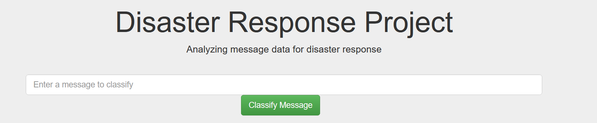
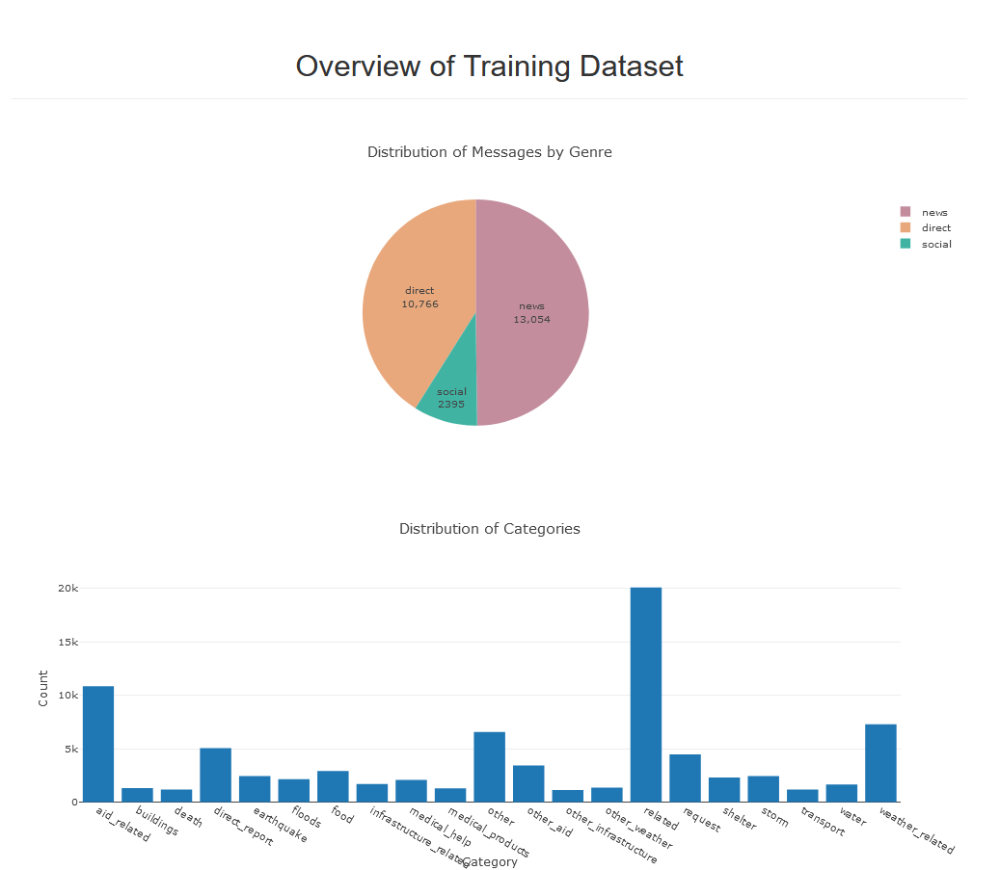
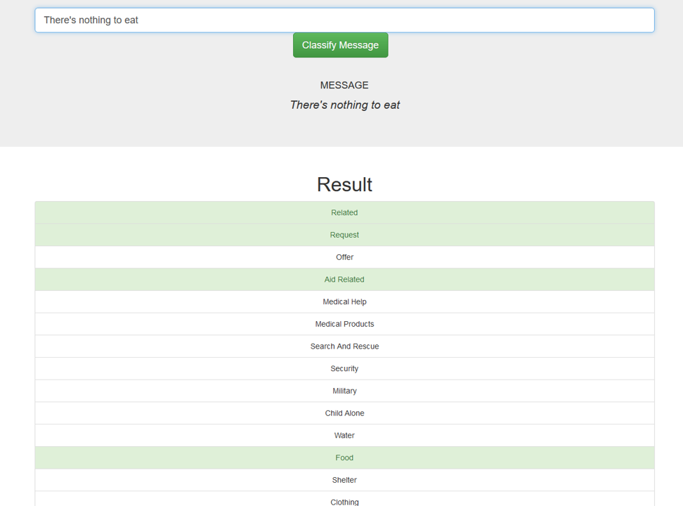

# Disaster Response Pipeline Project

1. [Project Motivation](#motivation)
2. [Getting started](#gettingstarted)
   1. [Requirements](#dependencies)
   2. [Installation](#installation)
3. [File Descriptions](#files)
4. [Screenshots](#screenshots)
5. [Licensing, Authors, and Acknowledgements](#licensing)

## Project Motivation
This project is part of the Udacity Data Scientist Nanodegree Program.

The dataset is provided by [FigureEIght](https://appen.com/). It contains more than 26000 pre-labelled messages sent during real-life disaster
situations (either via social media or directly to disaster response organizations). After being translated from the 
original language to English, the messages were classified into 36 categories.
The aim of the project was to build a Natural Language Processing tool that categorizes these messages. The resulting 
web app includes: 

1.	a search engine, where an emergency worker can enter a new message and receive classification results in several categories. 
2.	visualizations of the data

## Getting started 

### Requirements 
The `requirements.txt` file lists all Python libraries that are required for this project and they can be installed using: pip install -r requirements.txt
### Installation 
1. To clone this GIT repository use: git clone  https://github.com/eigenvektorin/disaster-response-pipeline

2. Run the following commands in the project's root directory to set up your database and model.

    - To run ETL pipeline that cleans data and stores in database
        `python data/process_data.py data/disaster_messages.csv data/disaster_categories.csv data/DisasterResponse.db`
    - To run ML pipeline that trains classifier and saves
        `python models/train_classifier.py data/DisasterResponse.db models/classifier.pkl`

3. Run the following command in the app's directory to run your web app.
    `python run.py`

4. Go to http://0.0.0.0:3001/

## File Descriptions 
The following folders and files are available in this repository:
-	data: contains sample messages and categories datasets in csv format
-	app: contains the run.py file to initiate the web app.
- `process_data.py`: This python file contains the ETL pipeline: It takes csv files (message data and message categories datasets) as input, cleans them and loads them into a SQL database
- `train_classifier.py`: This file contains the ML pipeline
- `requirements.txt`: lists dependencies

## Screenshots 
### Plots

### Example

## Acknowledgements

- FigureEight for providing the the data
- Udacity for providing the code skeleton for the flask web app.